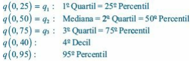

# 3 - Medidas-Resumo

## 3.1 - Medidas de posição

#### Moda

A observação mais frequente de um conjunto de dados.

#### Mediana

A observação que ocupa a posição central do conjunto de dados ordenados. Caso seja par,
toma-se a média entre os dois centrais.

## 3.2 Medidas de Dispersão

#### Desvio Médio

$$
   dm(X) =  \sum_{i = 1}^{n} |x_i - \overline{x}|
$$

#### Variância

$$
    var (X) = \sum_{i = 1}^{n} (x_i - \overline{x})^2
$$

#### Desvio Padrão

$$
    dp(X) = \sqrt{var(X)}
$$

## 3.3 Quantis Empíricos

#### O que é um quantil?

uma medida de ordem p, indicada por $q(p)$, em que $p$ é uma proporção qualquer,
$0<p<1$, tal que 100p% das obervações sejam menores do que $q(p)$.

#### Como identificar outliers?

Distância Interquatil:

$$d_q = q(0.75) - q(0.25)$$

Limite Superior:

$$
    LS = q_3 + 1,5d_q
$$

Limite Inferior:

$$
    LS = q_3 - 1,5d_q
$$

Uma outlier é uma observação que está acima do Limite Superior ou abaixo do Limite
inferior.
