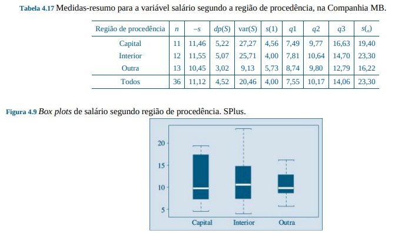

# Capítulo 4 - Análise Bidimensional

## 4.4 Medidas de Associação entre Variáveis Qualitativas

### Pearson chi-square

Usado para comparar uma observação com o valor esperado dado um hipótese
nula.

$$
    \chi ^ 2 = \sum_{i = 1}^{k} \frac{(O_i - E_i)^2}{E_i}
$$

### Coeficiente de contigência (Contingency Coefficient)

Comparando duas variáveis categórias temos esse chi-square:

Sendo $n_{ij}^ *$, o valor esperado

$$
    \chi ^ 2 = \sum_{i = 1}^{r} \sum_{i = 1}^{s}
    \frac{(n_{ ij } - n_{ ij } ^{ * }) ^ 2}{n_{ ij } ^ { * }}
$$

e o Coeficiente de contigência que deixa num intervalo limitado entre 0 e 1:

1, dependência completa
0, independência

$$
   C = \sqrt{\frac{\chi ^ 2}{\chi ^ 2 + n}}
$$

### Mutual Information

$$
    MI = \sum_{x \in X} \sum_{y \in Y}p(x, y) \log [ \frac{p(x, y)}{p(x) p(y)}]
$$

## 4.5 - Associação entre Variáveis Quantitativas

### Correlação

$$
    corr(X, Y) = \frac{1}{n}\sum_{i = 1}^{n}
    ( \frac{x_i - \overline{x}}{dp(X)} )
    ( \frac{y_i - \overline{y}}{dp(Y)} )
$$

### Covariância

$$
    cov(X, Y) = \frac{\sum_{i=1}^{n} (x_i - \overline{x})(y_i - \overline{y})}{n}
$$

#### Correlação com Covariância

$$
    corr(X, Y) = \frac{cov(X, Y)}{dp(X) \cdot dp(Y)}
$$

## 4.6 Associação entre Variáveis Qualitativas e Quantitativas

A ideia aqui é verificar a variância da variável quantitativa em cada categoria,
caso a variância em cada categoria seja pequena e menor que a global, quer dizer
que a variável categórica tem certa capacidade de explicar a variância da qualitativa.
Portanto, há uma relação entre as duas.

$$
    \overline{var(S)} = \frac{\sum_{i=1}^{k} n_i var_j (S)}{\sum_{i=1}^{k} n_i}
$$  

sendo k, o número de categorias e $var_i(S)$, a variância de S dentro da categoria i.

utilizando $R^2$:

$$
    R^2 = \frac{var(S) - \overline{var(S)}}{var(S)} = 1 - \frac{\overline{var(S)}}{var(S)}
$$
example:

$$
    \overline{var(S)}=\frac{12(7,77) + 18(13,10) + 6(16,89)}{12 + 18 + 6}
    = 11,96 \\
    var(S) = 20,46
$$

$$
    R^2 = 1- \frac{11,96}{20,46} = 0,415
$$

dizemos que 41,5% da variação total do salário é explicada pela
variável grau de instrução.
